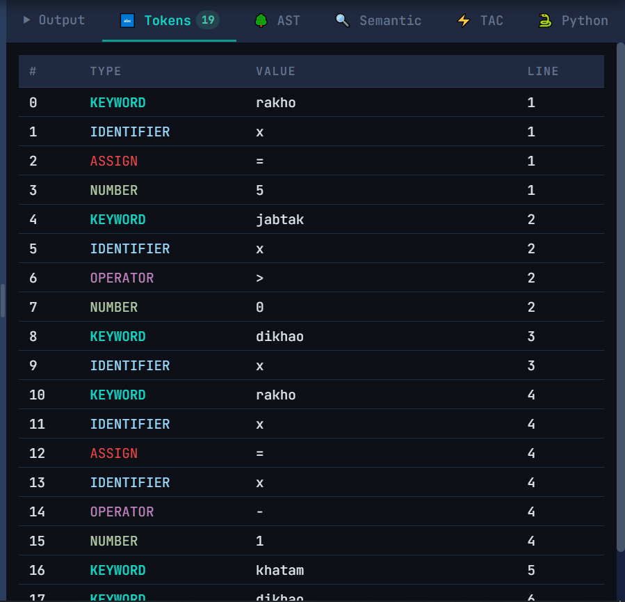
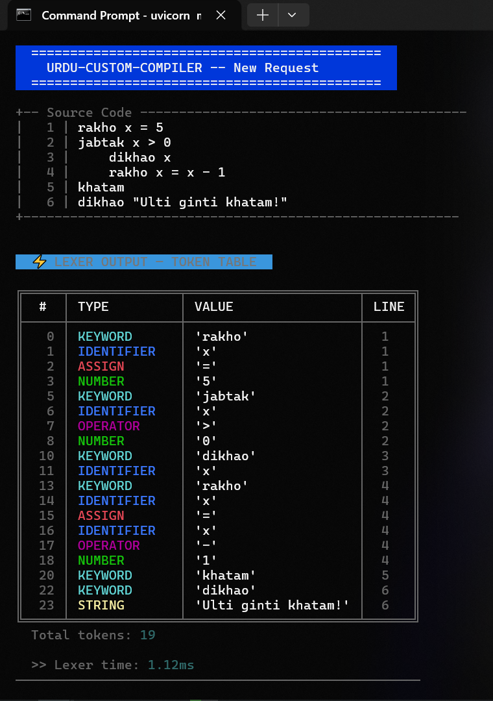
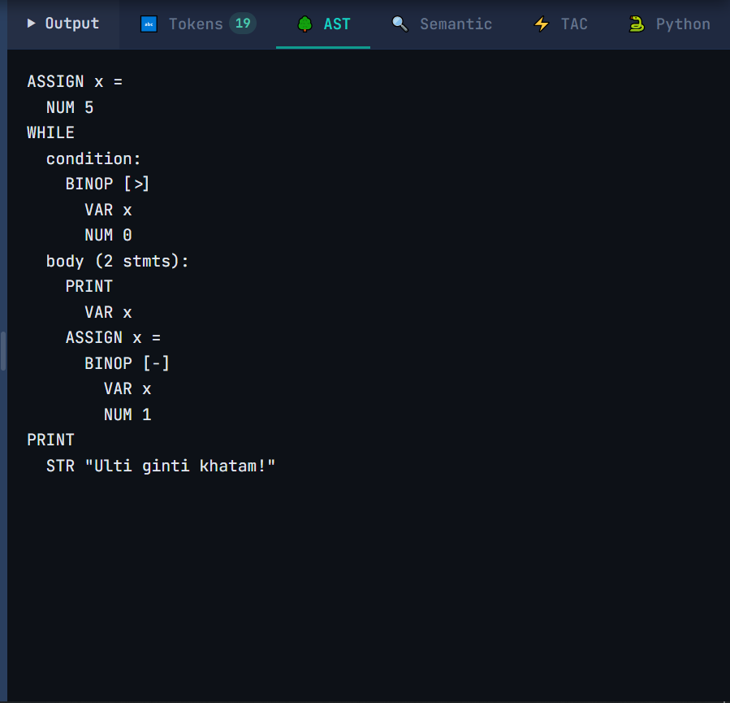
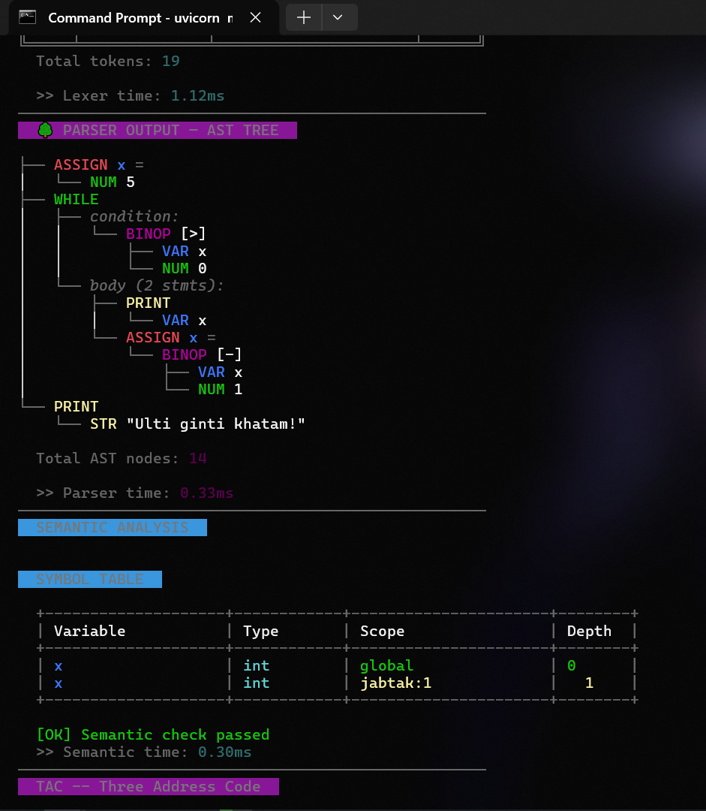
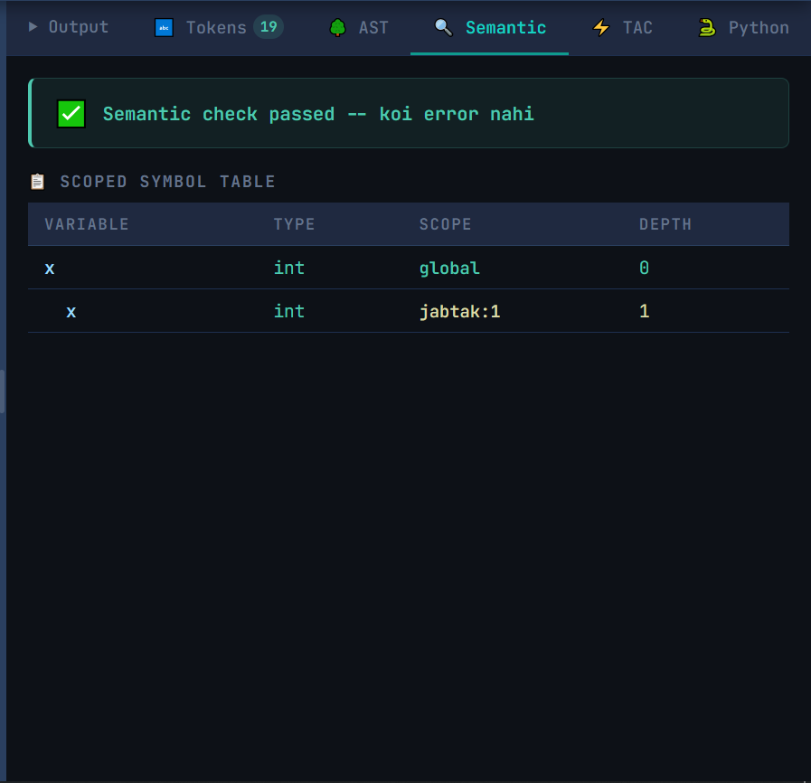
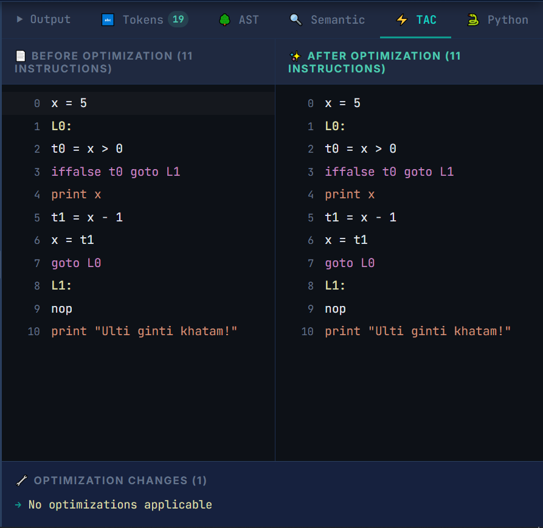
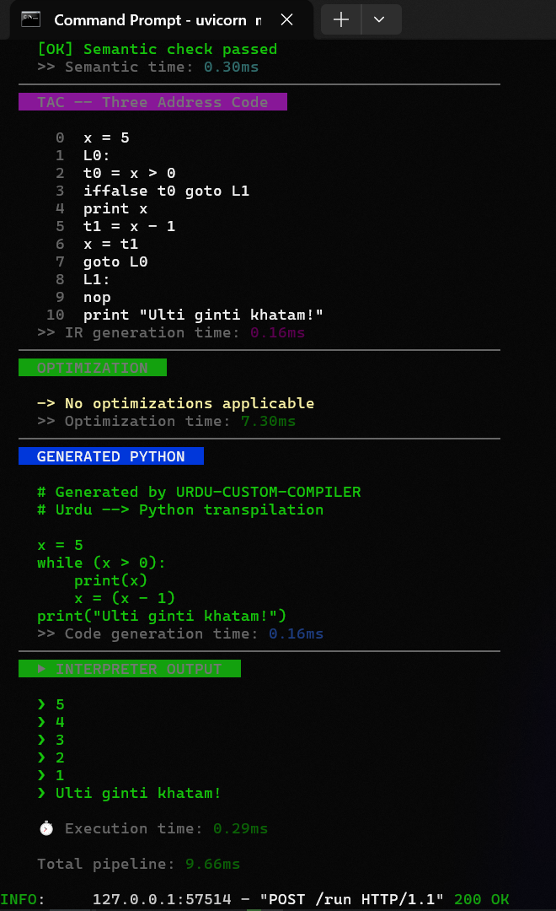
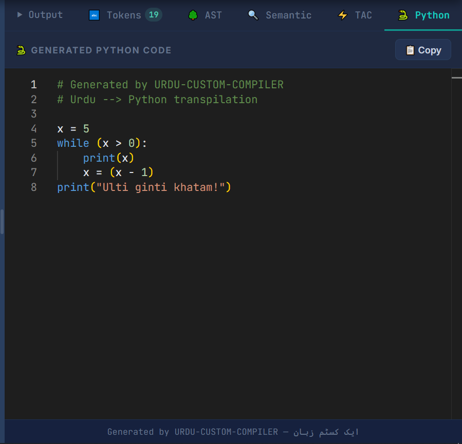
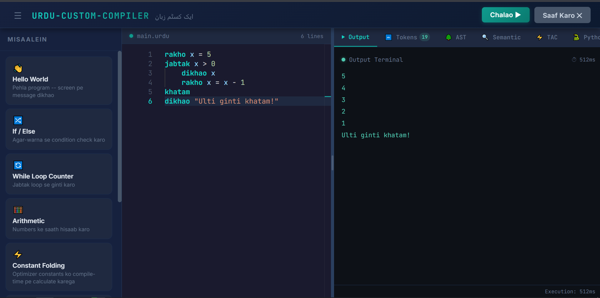

# URDU-CUSTOM-COMPILER 🇵🇰

<p align="center">

  <!-- Core -->
  
  
  
  
  
  

  <!-- Activity -->
  
  
  
  

  <!-- Languages -->
  
  

  <!-- Community -->
  
  
  

</p>

<p align="center">
  
</p>

<p align="center"><em>🖥 The Web IDE — Monaco Editor with real-time compiler pipeline visualization</em></p>

**ایک کسٹم زبان** — A custom programming language compiler and interpreter with **Roman Urdu** syntax. Write code in Urdu using familiar keywords, and watch it compile through a full pipeline: Lexer → Parser → Semantic Analysis → IR Generation → Optimization → Code Generation → Interpretation.

---

## 🔗 Quick Links

| | |
|---|---|
| 🌐 **Live Demo** | Run locally (see [Installation](#-installation)) |
| 📖 **Docs** | This README + inline code docs |
| 🐛 **Issues** | [GitHub Issues](https://github.com/H0NEYP0T-466/URDU-CUSTOM-COMPILER/issues) |
| 🤝 **Contributing** | [CONTRIBUTING.md](CONTRIBUTING.md) |

---

## 📑 Table of Contents

- [Features](#-features)
- [Language Reference](#-language-reference)
- [Quick Start](#-installation)
- [Usage Examples](#-usage-examples)
- [Architecture](#-architecture)
- [Compiler Pipeline Visualizations](#-compiler-pipeline-visualizations)
- [Folder Structure](#-folder-structure)
- [Tech Stack](#-tech-stack)
- [Dependencies & Packages](#-dependencies--packages)
- [Contributing](#-contributing)
- [License](#-license)
- [Security](#-security)
- [Code of Conduct](#-code-of-conduct)

---

## ✨ Features

- 🇵🇰 **Roman Urdu Syntax** — Write code using 12 Urdu keywords (`rakho`, `dikhao`, `agar`, `warna`, `jabtak`, `functionbnao`, `wapisbejo`, and more)
- 🔬 **Full Compiler Pipeline** — Lexer → Parser → Semantic Analysis → TAC IR → Optimizer → Python Codegen → Interpreter
- 🎨 **Web IDE** — Monaco Editor (the same editor as VS Code) with custom syntax highlighting, error markers, and a dark theme
- 📊 **Compiler Visualization** — View tokens, AST, TAC (Three Address Code), optimized IR, generated Python, and semantic symbol tables in real time
- ⚡ **Three Optimization Passes** — Constant propagation, constant folding, and dead code elimination at the IR level
- 🔒 **Semantic Analysis** — Type checking, scope resolution, undeclared variable detection, division-by-zero detection
- 📦 **Block Scoping** — Variables declared inside `agar`/`jabtak`/`functionbnao` blocks are local to that scope
- 🐍 **Python Code Generation** — Transpiles Urdu code to equivalent, runnable Python
- 🌐 **REST API** — FastAPI backend with a single `POST /run` endpoint
- 📱 **Responsive Split-Pane UI** — Resizable editor and output panels
- 🔧 **Function Definitions** — Define reusable functions with `functionbnao`, parameters, and `wapisbejo` return
- 📋 **Arrays** — Create arrays with `[1, 2, 3]`, access by index `arr[0]`, and modify elements `arr[0] = 99`
- 📝 **11 Built-in Examples** — Sidebar with runnable examples: Hello World, If/Else, While, Arithmetic, Functions, Arrays, and more
- 🧪 **Integration Tests** — 12 test cases covering the full pipeline including functions, arrays, scoping, and optimization

---

## 🇵🇰 Language Reference

### Keywords

| Keyword        | Meaning                |
|----------------|------------------------|
| `rakho`        | Declare/assign a variable |
| `dikhao`       | Print to output        |
| `agar`         | If statement           |
| `warna`        | Else clause            |
| `jabtak`       | While loop             |
| `khatam`       | End a block            |
| `sahi`         | Boolean true           |
| `ghalat`       | Boolean false          |
| `aur`          | Logical AND            |
| `ya`           | Logical OR             |
| `functionbnao` | Define a function      |
| `wapisbejo`    | Return from function   |

### Operators

| Operator | Meaning          |
|----------|------------------|
| `+ - * /` | Arithmetic     |
| `> < >= <= == !=` | Comparison |
| `!`      | Logical NOT      |
| `aur`    | Logical AND      |
| `ya`     | Logical OR       |

### Data Types

- **Numbers** — Integers and floats: `42`, `3.14`
- **Strings** — Double-quoted: `"Assalam o Alaikum"`
- **Booleans** — `sahi` (true), `ghalat` (false)
- **Arrays** — Ordered lists: `[10, 20, 30]`, accessible by index `arr[0]`

---

## 🚀 Installation

### Prerequisites

- **Python 3.10+** — [Download](https://www.python.org/downloads/)
- **Node.js 18+** — [Download](https://nodejs.org/)

### Backend Setup

```bash
cd backend
python -m venv venv
venv\Scripts\activate        # Windows
# source venv/bin/activate   # macOS/Linux
pip install -r requirements.txt
uvicorn main:app --reload --port 8008
```

The API will be available at `http://localhost:8008`.

### Frontend Setup

```bash
cd frontend
npm install
npm run dev
```

Open **http://localhost:5173** in your browser.

---

## ⚡ Usage Examples

### Example 1: Hello World

```
rakho naam = "Duniya"
dikaho "Assalam o Alaikum, "
dikaho naam
```

**Output:**
```
Assalam o Alaikum,
Duniya
```

### Example 2: If/Else

```
rakho x = 10
agar x > 5
    dikhao "x bara hai"
warna
    dikhao "x chota hai"
khatam
```

**Output:**
```
x bara hai
```

### Example 3: While Loop

```
rakho x = 3
jabtak x > 0
    dikhao x
    rakho x = x - 1
khatam
```

**Output:**
```
3
2
1
```

### Example 4: Block Scoping

```
rakho x = 10
agar x > 5
    rakho inner = 99
    dikhao inner
khatam
dikhao x
```

**Output:**
```
99
10
```

### Example 5: Logical Operators

```
rakho a = sahi
rakho b = ghalat
agar a aur b
    dikhao "dono sahi hain"
warna
    dikhao "koi ek ghalat hai"
khatam
```

**Output:**
```
koi ek ghalat hai
```

### Example 6: Functions — Definition & Return

```
functionbnao add(a, b)
    wapisbejo a + b
khatam

rakho result = add(3, 4)
dikaho result
```

**Output:**
```
7
```

### Example 7: Functions — Call in Expression

```
functionbnao double(x)
    wapisbejo x * 2
khatam

dikaho double(5) + 3
```

**Output:**
```
13
```

### Example 8: Arrays — Creation & Access

```
rakho nums = [10, 20, 30]
dikaho nums[0]
dikaho nums[2]
```

**Output:**
```
10
30
```

### Example 9: Arrays — Index Assignment

```
rakho nums = [10, 20, 30]
rakho nums[1] = 99
dikaho nums[1]
```

**Output:**
```
99
```

### Example 10: Functions + Arrays + While Loop

```
functionbnao sum_list(arr, size)
    rakho total = 0
    rakho i = 0
    jabtak i < size
        rakho total = total + arr[i]
        rakho i = i + 1
    khatam
    wapisbejo total
khatam

rakho mylist = [1, 2, 3, 4, 5]
dikaho sum_list(mylist, 5)
```

**Output:**
```
15
```

### API Usage (cURL)

```bash
curl -X POST http://localhost:8008/run \
  -H "Content-Type: application/json" \
  -d '{"code": "rakho x = 42\ndikhao x"}'
```

**Response:**
```json
{
  "output": "42",
  "tokens": [...],
  "ast": "ASSIGN x =\n  NUM 42\nPRINT\n  VAR x",
  "semantic": { "errors": [], "warnings": [], "symbol_table": {...} },
  "tac": { "original": [...], "optimized": [...], "changes": [...] },
  "generated_python": "x = 42\nprint(x)"
}
```

---

## 🏗 Architecture

The compiler follows a classic multi-stage pipeline:

```
┌──────────┐    ┌──────────┐    ┌──────────┐    ┌──────────┐
│  LEXER   │───▶│  PARSER  │───▶│ SEMANTIC │───▶│    IR    │
│          │    │          │    │ ANALYZER │    │GENERATOR │
│ Tokenize │    │ Recursive│    │ Type chk │    │   TAC    │
│ source   │    │ descent  │    │ Scoping  │    │          │
└──────────┘    └──────────┘    └──────────┘    └──────────┘
                                                       │
                                                       ▼
┌──────────┐    ┌──────────┐    ┌──────────┐    ┌──────────┐
│INTERPRETER│◀──│  CODEGEN │◀──│OPTIMIZER │◀──│   TAC    │
│          │    │          │    │          │    │          │
│ Tree-walk│    │ Python   │    │ Constant │    │ Three    │
│ execute  │    │ output   │    │ prop/fold│    │ Address  │
│          │    │          │    │ + DCE    │    │ Code     │
└──────────┘    └──────────┘    └──────────┘    └──────────┘
```

### Pipeline Stages

1. **Lexer** (`compiler/lexer.py`) — Converts source text into tokens. Handles keywords, operators, literals, and comments.
2. **Parser** (`compiler/parser.py`) — Recursive-descent parser that builds an Abstract Syntax Tree (AST).
3. **Semantic Analyzer** (`compiler/semantic.py`) — Type checking, scope resolution, undeclared variable detection, scoped symbol table.
4. **IR Generator** (`compiler/ir_generator.py`) — Converts AST to Three Address Code (TAC).
5. **Optimizer** (`compiler/optimizer.py`) — Three optimization passes on TAC: constant propagation, constant folding, and dead code elimination.
6. **Code Generator** (`compiler/codegen.py`) — Translates AST to equivalent Python source code.
7. **Interpreter** (`compiler/interpreter.py`) — Tree-walk interpreter that executes the AST directly.

---

## 📸 Compiler Pipeline Visualizations

See the compiler in action — every stage of the pipeline visualized in the Web UI.

### Stage 1: Lexer — Tokenization

The Lexer converts raw Urdu source code into a stream of tokens, each tagged with type, value, line, and column.

<p align="center">
  
</p>

<p align="center"><em>Token stream: each word, operator, and literal classified with position info</em></p>

<p align="center">
  
</p>

<p align="center"><em>Web IDE — Lexer panel showing the full token list</em></p>

### Stage 2: Parser — Abstract Syntax Tree (AST)

The Parser consumes the token stream and builds a tree representation of the program structure using recursive descent.

<p align="center">
  
</p>

<p align="center"><em>AST: hierarchical tree showing the program's syntactic structure</em></p>

<p align="center">
  
</p>

<p align="center"><em>Web IDE — Parser panel with AST tree and symbol table</em></p>

### Stage 3: Semantic Analysis — Type Checking & Scoping

The Semantic Analyzer validates the AST: type checking, scope resolution, undeclared variable detection, and scoped symbol table construction.

<p align="center">
  
</p>

<p align="center"><em>Semantic output: symbol table with types, scopes, errors, and warnings</em></p>

### Stage 4: TAC — Three Address Code Generation

The IR Generator converts the AST into Three Address Code (TAC), a low-level intermediate representation.

<p align="center">
  
</p>

<p align="center"><em>TAC instructions: original (unoptimized) vs. optimized after constant propagation, constant folding, and dead code elimination</em></p>

### Stage 5: Optimization — Constant Propagation, Folding & Dead Code Elimination

The Optimizer runs three passes on the TAC instructions: **constant propagation** (substitutes single-assignment variables with their literal values), **constant folding** (evaluates constant expressions like `3 + 4` to `7` at compile time), and **dead code elimination** (removes unused temporary variable assignments).

<p align="center">
  
</p>

<p align="center"><em>Web IDE — TAC, optimization diff, and generated Python all visible</em></p>

### Stage 6: Code Generation — Python Output

The Code Generator translates the AST into equivalent Python source code.

<p align="center">
  
</p>

<p align="center"><em>Generated Python: the Urdu program translated to executable Python</em></p>

### Stage 7: Execution — Interpreter Output

The tree-walk interpreter executes the AST directly and produces the final program output.

<p align="center">
  
</p>

<p align="center"><em>Web IDE — Final output panel showing the result of program execution</em></p>

---

## 📂 Folder Structure

```
URDU-CUSTOM-COMPILER/
├── backend/
│   ├── compiler/              # Core compiler package
│   │   ├── __init__.py        # Package exports
│   │   ├── lexer.py           # Tokenizer
│   │   ├── parser.py          # Recursive-descent parser → AST
│   │   ├── semantic.py        # Semantic analysis & type checking
│   │   ├── ir_generator.py    # Three Address Code generation
│   │   ├── optimizer.py       # Constant folding optimization
│   │   ├── codegen.py         # Python code generation
│   │   ├── interpreter.py     # Tree-walk interpreter
│   │   └── pretty_printer.py  # Terminal output formatting
│   ├── main.py                # FastAPI application & /run endpoint
│   ├── test_pipeline.py       # Integration tests
│   ├── requirements.txt       # Python dependencies
│   └── run_commands.txt       # Quick start commands
│
├── frontend/
│   ├── src/
│   │   ├── api/
│   │   │   └── compiler.ts    # REST API client
│   │   ├── components/
│   │   │   ├── Editor.tsx     # Monaco code editor
│   │   │   ├── Editor.css
│   │   │   ├── OutputPanel.tsx    # Execution output display
│   │   │   ├── OutputPanel.css
│   │   │   ├── TACPanel.tsx       # TAC visualization
│   │   │   ├── TACPanel.css
│   │   │   ├── SemanticPanel.tsx  # Symbol table display
│   │   │   ├── SemanticPanel.css
│   │   │   ├── PythonPanel.tsx    # Generated Python view
│   │   │   ├── PythonPanel.css
│   │   │   ├── ExamplesPanel.tsx  # Example programs sidebar
│   │   │   ├── ExamplesPanel.css
│   │   │   ├── Toolbar.tsx        # Run / Clear / Toggle buttons
│   │   │   └── Toolbar.css
│   │   ├── types/
│   │   │   └── compiler.ts    # TypeScript interfaces
│   │   ├── App.tsx            # Main application layout
│   │   ├── App.css
│   │   ├── main.tsx           # React entry point
│   │   └── index.css          # Global design tokens
│   ├── visuals/               # Screenshots & assets
│   ├── package.json
│   ├── tsconfig.json
│   └── vite.config.ts
│
├── .github/
│   ├── ISSUE_TEMPLATE/
│   │   ├── bug_report.yml
│   │   ├── feature_request.yml
│   │   └── config.yml
│   └── pull_request_template.md
│
├── LICENSE
├── CONTRIBUTING.md
├── SECURITY.md
├── CODE_OF_CONDUCT.md
└── README.md
```

---

## 🛠 Tech Stack

### Languages


### Frameworks & Libraries


### DevOps / CI / Tools


---

## 📦 Dependencies & Packages

### Runtime Dependencies

<details>
<summary><strong>🐍 Python (Backend)</strong></summary>

| Package | Version | Description |
|---------|---------|-------------|
|  | v0.115+ | High-performance async web framework |
|  | v0.34+ | ASGI server for running FastAPI |
|  | v2.10+ | Data validation using Python type annotations |

</details>

<details>
<summary><strong>⚛️ Node.js (Frontend)</strong></summary>

| Package | Version | Description |
|---------|---------|-------------|
|  | v19.2.5 | UI component library |
|  | v19.2.5 | React rendering for the DOM |
|  | v4.7.0 | VS Code's code editor as a React component |

</details>

### Dev / Build / Test Dependencies

<details>
<summary><strong>⚛️ Node.js (Frontend)</strong></summary>

| Package | Version | Description |
|---------|---------|-------------|
|  | v6.0.2 | Typed superset of JavaScript |
|  | v8.0.10 | Next-gen frontend build tool |
|  | v6.0.1 | Fast Refresh for Vite + React |
|  | v19.2.14 | TypeScript types for React |
|  | v19.2.3 | TypeScript types for React DOM |

</details>

---

## 🤝 Contributing

We welcome contributions! Please read our [Contributing Guide](CONTRIBUTING.md) for details on how to get started, code style guidelines, and the PR process.

---

## 📜 License

This project is licensed under the [MIT License](LICENSE).

---

## 🛡 Security

See our [Security Policy](SECURITY.md) for information on reporting vulnerabilities and known security considerations.

---

## 📏 Code of Conduct

This project adheres to the [Contributor Covenant Code of Conduct](CODE_OF_CONDUCT.md). By participating, you are expected to uphold this code.

---

<p align="center">Made with ❤ by <a href="https://github.com/H0NEYP0T-466">H0NEYP0T-466</a></p>
